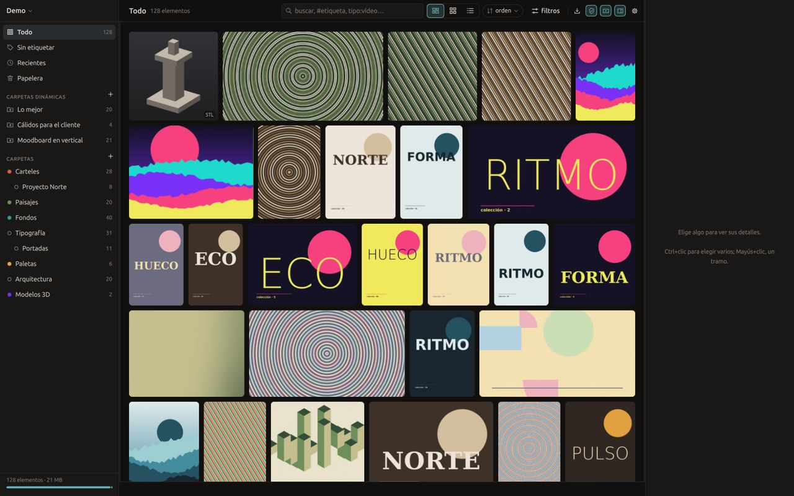

<p align="center">
  
</p>

<h1 align="center">Grimorio</h1>

<p align="center">
  Tu biblioteca visual, en tu disco.<br>
  Guarda, ordena y encuentra referencias: imágenes, vídeo, sonido, PDF y modelos 3D.<br>
  Libre, nativa, para Linux y Windows. Sin nube, sin IA y sin un navegador dentro.
</p>

<p align="center">
  <a href="https://grimorio.dohkku.dev">Web</a> ·
  <a href="https://grimorio.dohkku.dev/demo/">Demo en el navegador</a> ·
  <a href="https://github.com/Dohkku/grimorio/releases/latest">Descargar</a> ·
  <a href="#english">English</a>
</p>



## Qué hace

- **Todo en un sitio.** Imágenes (también PSD, AI, EPS, Krita, Sketch y RAW),
  vídeo que se reproduce al pasar el ratón, sonido con su onda y su espectro,
  PDF con visor y modelos 3D (STL, OBJ, PLY, glTF, 3MF, y `.blend`/`.fbx` con
  Blender instalado).
- **Ordenar sin esfuerzo.** Etiquetas con grupos y colores, estrellas, notas,
  carpetas anidadas con color y **carpetas dinámicas** que se rellenan solas
  con un filtro.
- **Encontrar al instante.** Un buscador que entiende `#etiqueta`,
  `estrellas:>=4`, `tipo:vídeo`, fechas y colores, y que sugiere mientras
  escribes. Responde en milisegundos con cien mil elementos.
- **Mirar de verdad.** Visor con zoom hasta el píxel y cuentagotas, onda de
  los sonidos, páginas de los PDF y modelos 3D con ejes como en Blender.
- **Con el teclado.** Estrellas con los números, `Ctrl+K` para etiquetar,
  `F2` para renombrar (también en lote, con patrón), `Ctrl+Z` para deshacer
  cualquier cosa.
- **A tu manera.** Tema noche o papel, tamaño de la interfaz, modo seguro que
  difumina lo marcado como +18, repetidos, carpetas del disco vigiladas,
  capturas de pantalla, pegar desde el portapapeles o una URL.

## Tus datos son tuyos

La biblioteca es una carpeta. Cada elemento tiene su original y un
`item.json` legible al lado:

```json
{
  "name": "estudio de iluminación nocturna",
  "tags": ["nocturno", "referencia"],
  "stars": 4,
  "note": "textura del reflejo en el asfalto",
  "folders": ["01JKF…"]
}
```

`index.sqlite` y las miniaturas son derivados: se pueden borrar y
`grim reindex` los rehace. La carpeta se sincroniza con Syncthing o Dropbox y
se copia como cualquier otra. El formato está especificado en
[docs/FORMATO.md](docs/FORMATO.md).

## Las cinco decisiones

1. **Tus datos son tuyos y son legibles.** Un JSON por elemento; el índice se
   reconstruye.
2. **Nada de webview.** Ni Electron, ni Tauri, ni WebKitGTK. Qt 6 nativo.
3. **El núcleo no sabe qué es una ventana.** `grimorio-core` compila y se
   prueba sin escritorio; la interfaz y `grim` son clientes.
4. **El estilo es dato.** Ni un color ni una medida a mano en la interfaz:
   todo sale de un tema JSON que se recarga al guardarlo.
5. **Sin IA.**

## Instalar

- **Windows:** el instalador `Grimorio-x.y.z-windows-x64-instalador.exe` o el `.zip` portable
  de la [última versión](https://github.com/Dohkku/grimorio/releases/latest).
- **Linux:** el `.tar.gz` de la misma página (usa el Qt 6 del sistema), o compilar (abajo).

Opcionales, para sacar más de cada archivo: `ffmpeg` (vídeo y sonido),
`pdftoppm` de Poppler (PDF), Blender (`.blend`, `.fbx`), ImageMagick (PSD,
AI, EPS). Sin ellos los archivos entran igual, con menos detalle.

## Compilar

Hace falta Rust estable, CMake y Qt 6.4 o más nuevo (Quick, Qml, Multimedia,
OpenGL, Network; DBus en Linux).

```sh
cargo build --release                         # núcleo y `grim`
cmake -S app -B app/build -DCMAKE_BUILD_TYPE=Release
cmake --build app/build -j
./app/build/grimorio ~/Referencias.grimorio
```

En Ubuntu 24.04 los paquetes están listados en
[docs/DEPENDENCIAS.md](docs/DEPENDENCIAS.md); Windows, en
[docs/WINDOWS.md](docs/WINDOWS.md).

### Desde la terminal

```sh
export GRIMORIO_LIB=~/Referencias.grimorio
grim init $GRIMORIO_LIB
grim import ~/Descargas/imagenes --tag inspiración
grim search "#cartel estrellas:>=4 orientacion:vertical"
grim stats
```

## Probar y medir

```sh
cargo test --release                          # núcleo, CLI y puente
(cd app/build && ctest)                       # interfaz: lint, malla, arrastre
grim synth /tmp/cien-mil.grimorio --items 100000
grim -L /tmp/cien-mil.grimorio bench query    # presupuesto: p95 < 30 ms
```

Y pruebas de usuario de verdad: la app manejada con ratón y teclado simulados
en una pantalla virtual, comprobando en disco cada gesto
([herramientas/recorrido](herramientas/recorrido/recorrido.py)).

## Documentación

- [docs/PLAN.md](docs/PLAN.md): alcance, arquitectura e hitos
- [docs/FORMATO.md](docs/FORMATO.md): el formato de biblioteca
- [docs/DEPENDENCIAS.md](docs/DEPENDENCIAS.md): qué entra y con qué licencia
- [app/README.md](app/README.md): la aplicación y todos sus atajos
- [CONTRIBUTING.md](CONTRIBUTING.md): cómo contribuir

## Licencia

[AGPL-3.0](LICENSE.md), software libre. Hecho por [Frederick Andrade](https://frederickandrade.com).

---

<a id="english"></a>

## English

**Grimorio** is a free, open-source visual reference library for Linux and
Windows, an alternative to Eagle. It keeps images (including PSD, AI, EPS,
Krita, Sketch and RAW previews), video, audio, PDFs and 3D models in a
library you can search instantly, with tags, stars, colors, nested folders and
dynamic folders that fill themselves from a filter. It is native (Rust core,
Qt 6 interface), with no cloud, no AI and no embedded browser.

Your library is a plain folder with one readable `item.json` per item; the
search index and thumbnails are derived and can be rebuilt with
`grim reindex`. Sync it with Syncthing or Dropbox, back it up by copying it.

Download it from the [releases page](https://github.com/Dohkku/grimorio/releases/latest)
or [try the interface in your browser](https://grimorio.dohkku.dev/en/demo/).
Build instructions are above (`cargo build --release`, then CMake). The code,
comments and docs are written in Spanish; issues and pull requests in English
are welcome.
